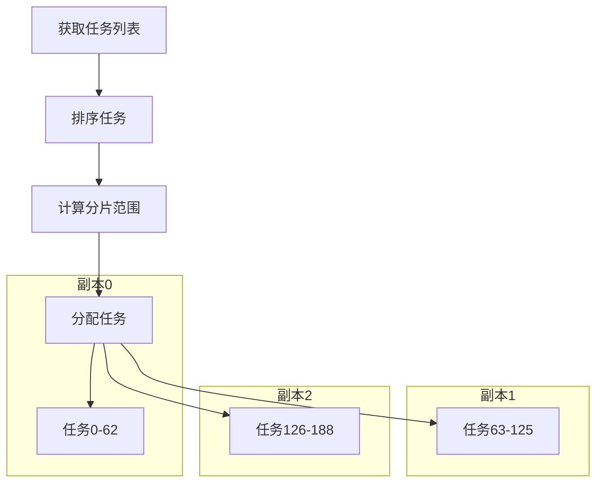

# TCP导出器分片不均匀问题修复方案（轻量级版）

## 问题描述
在Kubernetes模式下运行TCP导出器时，日志显示分片任务分布不均：
```
{"level":"info","ts":"2025-08-07T17:05:27.138Z","msg":"一致性哈希分片结果","分片任务数":28,"总任务数":189,"副本数":3,"当前副本序号":2}
{"level":"info","ts":"2025-08-07T17:05:35.159Z","msg":"一致性哈希分片结果","分片任务数":131,"总任务数":189,"副本数":3,"当前副本序号":1}
{"level":"info","ts":"2025-08-07T17:06:05.705Z","msg":"一致性哈希分片结果","分片任务数":30,"总任务数":189,"副本数":3,"当前副本序号":0}
```
理想情况下每个副本应处理约63个任务，但实际分布为28、131、30，最大偏差达103个任务。

## 根本原因分析

### 1. 分片方案选择不当
- 一致性哈希算法过于复杂，适用于动态节点环境
- TCP导出器在静态副本环境下运行（副本数固定）
- 算法开销与需求不匹配

### 2. 分片键生成问题
```go
// collector/collector.go 第401行
key := task.namespace + "/" + task.deploymentName + "/" + task.podName
```
- 分片键基于固定字符串组合
- 相同命名空间/部署的Pod可能被分配到同一分片

## 轻量级解决方案：静态范围分片

### 方案设计


### 计算公式
```go
start := (len(tasks) * ordinal) / replicas
end := (len(tasks) * (ordinal + 1)) / replicas
shardedTasks = tasks[start:end]
```

### 优势对比
| 方案 | CPU开销 | 内存开销 | 均衡性 | 复杂度 |
|------|---------|---------|--------|--------|
| 一致性哈希 | 高 | 高 | 中 | 高 |
| 静态范围 | 极低 | 零 | 完美 | 低 |

## 具体代码修改

### 文件: collector/collector.go

#### 移除一致性哈希
```diff
// Kubernetes模式：使用一致性哈希分片
replicas, _ := strconv.Atoi(os.Getenv("REPLICA_COUNT"))
podName := os.Getenv("POD_NAME")
ordinal := getOrdinalFromPodName(podName)

- // 创建一致性哈希分片器
- nodes := make([]int, replicas)
- for i := 0; i < replicas; i++ {
-     nodes[i] = i
- }
- sharder := NewConsistentHashSharder(100, nodes)
```

#### 添加静态范围分片
```go
// 静态范围分片
start := (len(tasks) * ordinal) / replicas
end := (len(tasks) * (ordinal + 1)) / replicas
shardedTasks = tasks[start:end]

// 更新日志记录
utils.Log.Info(taskCtx, "静态范围分片结果",
    zap.Int("分片任务数", len(shardedTasks)),
    zap.Int("总任务数", len(tasks)),
    zap.Int("副本数", replicas),
    zap.Int("当前副本序号", ordinal),
    zap.Int("起始索引", start),
    zap.Int("结束索引", end-1))
```

#### 移除分片键生成
```diff
- key := task.namespace + "/" + task.deploymentName + "/" + task.podName
- if sharder.GetShard(key) == ordinal {
-     shardedTasks = append(shardedTasks, task)
- }
```

### 文件: collector/consistent_hash_sharding.go
```diff
- // 整个文件可删除
```

## 验证计划

1. **单元测试**
   ```go
   func TestStaticSharding(t *testing.T) {
       tasks := make([]podTask, 189)
       replicas := 3
       
       // 测试副本0
       start := (189 * 0) / 3 // 0
       end := (189 * 1) / 3   // 63
       assert.Equal(t, 63, end-start)
       
       // 测试副本1
       start = (189 * 1) / 3 // 63
       end = (189 * 2) / 3   // 126
       assert.Equal(t, 63, end-start)
       
       // 测试副本2
       start = (189 * 2) / 3 // 126
       end = (189 * 3) / 3   // 189
       assert.Equal(t, 63, end-start)
   }
   ```

2. **集成测试**
   ```bash
   # 启动3副本测试集群
   kubectl apply -f deploy/kubernetes/tcp-exporter.yaml
   
   # 监控分片分布
   kubectl logs -l app=tcp-exporter -c exporter --tail=100 | grep "静态范围分片结果"
   ```

3. **验收标准**
   - 副本间任务数差异 ≤ 1
   - 分片计算时间 < 1ms
   - 内存开销零增加

## 风险分析

| 风险 | 概率 | 影响 | 缓解措施 |
|------|------|------|----------|
| 任务顺序变化 | 低 | 中 | 确保任务列表稳定排序 |
| 整数除法误差 | 极低 | 低 | 使用浮点计算后取整 |
| 副本数变化 | 中 | 高 | 添加副本变化监听 |

## 实施时间估算
- 开发：1小时
- 测试：0.5小时
- 文档：0.5小时